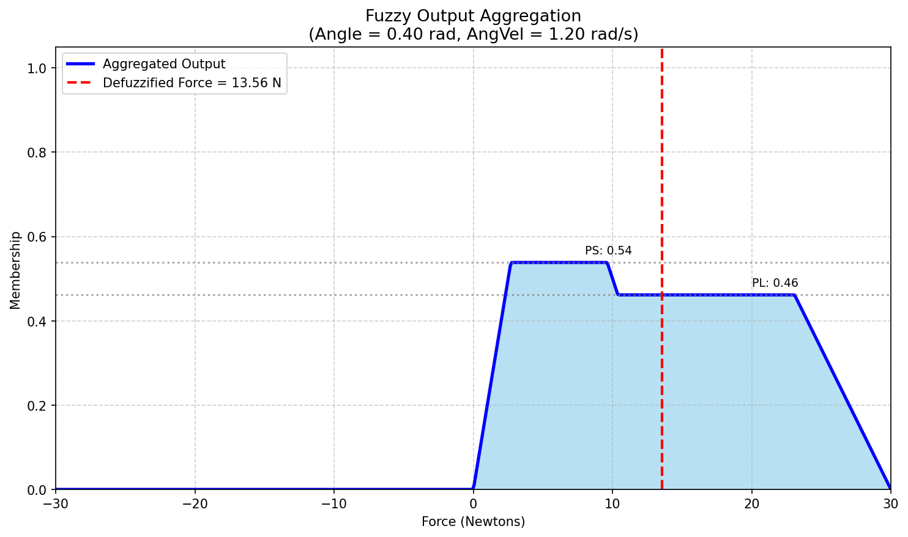

# 🤹‍♂️ Fuzzy Logic Inverted Pendulum Simulator

A **fully self-contained**, **interactive** simulation of the classic **inverted pendulum problem** stabilized using **manually implemented fuzzy logic control** — **no external fuzzy libraries** required.

> ✨ **Drag the cart with your mouse** to disturb the system and watch the fuzzy controller fight to keep the pendulum upright!

---

## 📚 Table of Contents
- Mathematical Background
- Fuzzy Universes and Membership Functions
- Fuzzy Logic Implementation
- Force (Output) Universe
- Code Structure
- How to Use
- Requirements

---

## 🧮 Mathematical Background

### The Inverted Pendulum Problem

The inverted pendulum on a cart is a **nonlinear, unstable, underactuated system** and a benchmark in control theory. The goal is to balance a pendulum in its upright (inverted) position by applying horizontal forces to the cart.

#### State Variables
- $ x $: Cart position (m)
- $ \dot{x} $: Cart velocity (m/s)
- $ \theta $: Pendulum angle from vertical (radians)
- $ \dot{\theta} $: Angular velocity (rad/s)

#### Equations of Motion

Using Lagrangian mechanics, the nonlinear dynamics are:

$$
\ddot{\theta} = \frac{g \sin\theta - \cos\theta \left( \frac{F + m l \dot{\theta}^2 \sin\theta}{M + m \sin^2\theta} \right)}{l \left( \frac{4}{3} - \frac{m \cos^2\theta}{M + m \sin^2\theta} \right)}
$$

$$
\ddot{x} = \frac{F + m l (\dot{\theta}^2 \sin\theta - \ddot{\theta} \cos\theta)}{M + m \sin^2\theta}
$$

Where:
- $ M = 1.0  \text{kg} $: Cart mass
- $ m = 0.2  \text{kg} $: Pendulum mass
- $ l = 0.5  \text{m} $: Pendulum half-length
- $ g = 9.81  \text{m/s}^2 $: Gravity
- $ F $: Control force (N)

The system is **inherently unstable**: without active control, any small deviation causes the pendulum to fall.

---
## 🌐 Fuzzy Universes and Membership Functions

The fuzzy controller operates over three carefully designed **universes of discourse**, each discretized for numerical computation:

### 1. **Angle Universe**
- **Range**: \([-1.5, 1.5]\) radians (≈ ±86°)
- **Resolution**: 300 points
- **Purpose**: Covers near-horizontal pendulum positions while avoiding the singularity at ±90° (±π/2 ≈ ±1.57 rad)
- **Membership Functions**: 5 overlapping triangular sets  
  `NL` ← `NS` ← `Z` → `PS` → `PL`

| Label  | Full Name          | Meaning              | Typical Range                 |
|--------|--------------------|----------------------|-------------------------------|
| **NL** | Negative Large     | Strongly negative    | Angle: < −0.75 rad            |
| **NS** | Negative Small     | Slightly negative    | Angle: −0.75 to −0.1 rad      |
| **Z**  | Zero               | Near neutral         | Angle: −0.1 to +0.1 rad       |
| **PS** | Positive Small     | Slightly positive    | Angle: +0.1 to +0.75 rad      |
| **PL** | Positive Large     | Strongly positive    | Angle: > +0.75 rad            |

### 2. **Angular Velocity Universe**
- **Range**: \([-8, 8]\) rad/s (≈ ±458°/s)
- **Resolution**: 400 points
- **Purpose**: Accommodates fast swings during disturbances while maintaining control authority
- **Membership Functions**: Same 5 labels as angle, scaled to velocity dynamics

### 3. **Force (Output) Universe**
- **Range**: \([-30, 30]\) Newtons
- **Resolution**: 600 points (higher resolution for accurate defuzzification)
- **Purpose**: Provides sufficient actuation range to recover from large tilts without unrealistic forces
- **Membership Functions**: 5 triangular output sets used in aggregation and centroid calculation

These universes are defined using `np.linspace` and form the foundation for all fuzzification, rule evaluation, and defuzzification steps. The triangular membership functions are constructed from **7 anchor points** to ensure smooth overlap between adjacent fuzzy sets—critical for stable control behavior.





## 🌫️ Fuzzy Logic Implementation

This project implements a **Mamdani-type fuzzy logic controller** from scratch — **no `scikit-fuzzy` or external dependencies**.

### Core Components

#### 1. **Fuzzification**
- Converts crisp inputs (`angle`, `angular_velocity`) into degrees of membership in fuzzy sets.
- Uses **triangular membership functions** over:
  - Angle: $[-1.5, 1.5]$ rad
  - Angular velocity: $[-8, 8]$ rad/s

#### 2. **Rule Base (25 Rules)**
Human-like IF-THEN rules, e.g.:
> **IF** angle is *Positive Small* **AND** angular velocity is *Zero*  
> **THEN** apply *Positive Small* force.

All rules use **min** for AND and **max** for OR (standard Mamdani).

#### 3. **Inference & Aggregation**
- Each rule fires at a strength = `min(membership_angle, membership_angvel)`
- Output fuzzy sets are **clipped** at their activation level
- Aggregated via **max** combination

#### 4. **Defuzzification**
- **Centroid method** (center of gravity):
  $$
  F = \frac{\int \mu(F) \cdot F  dF}{\int \mu(F)  dF}
  $$
- Computed numerically using `np.trapz`

### Fuzzy Sets
| Label | Meaning             |
|-------|---------------------|
| NL    | Negative Large      |
| NS    | Negative Small      |
| Z     | Zero                |
| PS    | Positive Small      |
| PL    | Positive Large      |

---

## 🏗️ Code Structure
```
inverted_pendulum_fuzzy.py
│
├── class FuzzyController
│ ├── _trimf() : Triangular membership function
│ ├── _create_mf() : Build 5 overlapping MFs from 7 points
│ ├── fuzzify() : Convert crisp input → membership degrees
│ ├── rule_base() : Apply 25 IF-THEN rules (max-min inference)
│ ├── defuzzify() : Centroid calculation
│ └── compute() : Full pipeline: fuzzify → rules → defuzzify
│
├── class InvertedPendulum
│ ├── dynamics() : Nonlinear EOM (exact physics)
│ └── step() : Euler integration
│
└── class InteractivePendulum
├── on_click/motion : Mouse drag interaction
├── update() : Real-time simulation loop
└── show() : Start interactive window
```

---

## 🎮 How to Use

### 1. **Run the Simulation**
```bash
python inverted_pendulum_fuzzy.py
```

### 2. Interact with the Pendulum
- **Drag the black cart** left/right with your mouse to disturb the system.  
- The **fuzzy controller automatically stabilizes** the pendulum.  
- **Press SPACEBAR** to pause/resume the simulation.  
- If the pendulum falls beyond ±90°, it **auto-resets**.

### 3. What to Try
- **Gentle nudge**: Slow drag → small tilt → smooth recovery.  
- **Hard jerk**: Fast drag → large swing → watch the controller fight!  
- **Hold at edge**: Drag to `x = ±2` → cart stops, pendulum swings freely.  

> 💡 **Tip**: The controller works best for moderate disturbances. Extreme inputs may cause failure — just like real systems!

---

## ⚙️ Requirements

Only standard scientific Python packages:

```bash
pip install numpy matplotlib
```

## 🙌 Acknowledgements

- Based on classic control theory and Zadeh's fuzzy logic (1965)  
- Physics derived from standard Lagrangian mechanics  
- Interactive design inspired by real-time control demos  

> **"Fuzzy logic turns human intuition into mathematical control."**  
> — Try dragging the cart and feel the intelligence in action! 🤖

---

**Author**: Karim Lazghab 

**Last Updated**: October 2025
